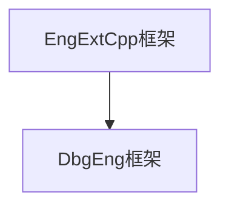

# Windbg extensions

> https://learn.microsoft.com/en-us/windows-hardware/drivers/debugger/debugger-engine-and-extension-apis

> 从 **NT\sdktools\debuggers\exts\extsdll**  我们能够看到微软调试器内部的工作


> 该节你可以编写   DbgEng扩展  EngExtCpp扩展  WdbgExts 扩展


## Wdbgexts.h

> 函数原型和Routine例程详情

### PWINDBG_OUTPUT_ROUTINE

> [PWINDBG_OUTPUT_ROUTINE](https://learn.microsoft.com/en-us/windows-hardware/drivers/ddi/wdbgexts/nc-wdbgexts-pwindbg_output_routine?redirectedfrom=MSDN) 该回调函数打印格式化字符串到调试器命令窗口

> dprintf函数当打印的字符串太大，可能会受到调试器引擎或操作系统的限制
>
> 某些调试器引擎在单次输出中限制16k字符


### Functions

> https://learn.microsoft.com/en-us/windows-hardware/drivers/debugger/wdbgexts-functions


```
{
	GetContext
	SetContext
	dprintf
	Disasm  // 反汇编指定地址的指令
}
```


## Dbgeng.h

> https://learn.microsoft.com/en-us/windows-hardware/drivers/debugger/dbgeng-extension-design-guide

> https://learn.microsoft.com/en-us/windows-hardware/drivers/ddi/dbgeng/nc-dbgeng-pdebug_extension_call


### DebugCreate


### PDEBUG_EXTENSION_CALL

> dbgeng 调试器引擎回调原型

```c
PDEBUG_EXTENSION_CALL PdebugExtensionCall;

HRESULT PdebugExtensionCall(
    // 指向 DEBUG_CLIENT的接口指针   DEBUG_CLIENT用来与调试器交互
  [in]           PDEBUG_CLIENT Client,
    // 命令行调用 可选参数
  [in, optional] PCSTR Args
)
{...}
```

> 导出函数必须是 小写字母


### Anatomy of a DbgEng Extension DLL

> 如果有多个dll 导出了相同的函数
>
> 在windbg调用 !dll.function


> DbgEng 扩展dll必须导出 DebugExtensionInitialize  当dll被加载时初始化dll, 用来初始化全局变量

```c
PDEBUG_CLIENT2   g_Client = NULL;
PDEBUG_CONTROL2  g_Control = NULL;
HRESULT CALLBACK  DebugExtensionInitialize(PULONG Version, PULONG Flags)
{
    // https://learn.microsoft.com/en-us/windows-hardware/drivers/ddi/dbgeng/nc-dbgeng-pdebug_extension_initialize
	*Version = DEBUG_EXTENSION_VERSION(1, 0);
	*Flags = 0;
	DebugCreate(__uuidof(IDebugClient2), (void**)&g_Client);
	return g_Client->QueryInterface(__uuidof(IDebugControl2), (void**)&g_Control);
}
```


> DbgEng 可以选择导出  DebugExtensionUninitialize  在dll被卸载时，用来清空资源


> 可选导出 DebugExtensionNotify  当session启动或结束时，目标启动执行和停止时调用
>
> 通知提供uo IDebugEventCallbacks 注册

> https://learn.microsoft.com/en-us/windows-hardware/drivers/ddi/dbgeng/nc-dbgeng-pdebug_extension_notify


```c
PDEBUG_EXTENSION_NOTIFY PdebugExtensionNotify;

void PdebugExtensionNotify(
    // DEBUG_NOTIFY_SESSION_ACTIVE 调试session激活
    // DEBUG_NOTIFY_SESSION_INACTIVE 没有调试会话
    // DEBUG_NOTIFY_SESSION_ACCESSIBLE 调试session已经被挂起了 现在可以访问
  [in] ULONG Notify,
  [in] ULONG64 Argument
)
{...}
```


> An extension DLL may export [*KnownStructOutput*](https://learn.microsoft.com/en-us/windows-hardware/drivers/ddi/dbgeng/nc-dbgeng-pdebug_extension_known_struct). If this is exported, it will be called when the DLL is loaded. This function returns a list of structures that the DLL knows how to print on a single line. It may be called later to format instances of these structures for printing


> 调试器引擎加载 DbgEng扩展dll的过程

> 当扩展dll初始时 调用DebugExtensionInitialize函数
>
> 调试器引擎会放到 try except块内调用这些扩展dll  从而保护调试器引擎避免一些类型的bug，
>
> 但是，因为扩展调用和调试器引擎在同一线程，仍然有可能造成崩溃。


### Using Clients and the Engine

> DbgEng 扩展通过  client object与调试器引擎交互
>
> 调试器引擎提供了一个接口用来examining and manipulating (读写) 调试目标，无论用户模式还是内核模式

```
{
	设置断点
	监控事件
	查询模块
	读写内存
	控制目标进程和线程
}
```

> debugger engine application  调试器应用程序 - 可以使用调试器引擎的所有功能
>
> Windbg,  CDB, NTSD, KD调试器
>
> 调试器引擎API定义在  dbgeng.h


### Writing DbgEng Extension Code

> Dbgeng 也可以使用  wdbgexts.h 中的函数  
>
> 在引入wdbgexts.h头文件前必须定义宏  KDEXT_64BIT
>
> 还需要在  DebugExtensionInitialize 中调用  GetWindbgExtensionApis64函数

```c
#define KDEXT_64BIT
#include wdbgexts.h
#include dbgeng.h
```


### Build

> 编译需引入   dbgeng.lib


```c++
#include <windows.h>
#include <dbgeng.h>

PDEBUG_CLIENT2   g_Client = NULL;
PDEBUG_CONTROL2  g_Control = NULL;
/// Step 1. 加载dll
HRESULT CALLBACK  DebugExtensionInitialize(PULONG Version, PULONG Flags)
{
	*Version = DEBUG_EXTENSION_VERSION(1, 0);
	*Flags = 0;
	DebugCreate(__uuidof(IDebugClient2), (void**)&g_Client);
	return g_Client->QueryInterface(__uuidof(IDebugControl2), (void**)&g_Control);
}

///
/// 可选的导出
/// Step 0. 卸载dll
VOID CALLBACK DebugExtensionUninitialize()
{
	g_Control->Output(DEBUG_OUTPUT_NORMAL,"unload dll\n");
}

///
/// IDebugEventCallbacks
/// https://learn.microsoft.com/en-us/windows-hardware/drivers/ddi/dbgeng/nn-dbgeng-idebugeventcallbacks
/// 
void DebugExtensionNotify(
	ULONG Notify,
	ULONG64 Argument
)
{
	switch (Notify)
	{
		case DEBUG_NOTIFY_SESSION_ACTIVE:
		{
			g_Control->Output(DEBUG_OUTPUT_NORMAL, "A debugging session is active. The session may not necessarily be suspended\n");
			break;
		}
		case DEBUG_NOTIFY_SESSION_INACTIVE:
		{
			g_Control->Output(DEBUG_OUTPUT_NORMAL, "No debugging session is active.\n");
			break;
		}
		case DEBUG_NOTIFY_SESSION_ACCESSIBLE:
		{

			g_Control->Output(DEBUG_OUTPUT_NORMAL, "The debugging session has suspended and is now accessible.\n");
			break;
		}
		case DEBUG_NOTIFY_SESSION_INACCESSIBLE:
		{
			g_Control->Output(DEBUG_OUTPUT_NORMAL, "The debugging session has started running and is now inaccessible\n");
			break;
		}
		default:
			break;
	}

}
```


## EngExtCpp Extensions

> EngExtCpp 扩展库 使用EngExtCpp扩展框架  **EngExtCpp.h**

> 当扩展库被调试器引擎加载后，它的方法和函数能够提供额外的功能或者在用户模式和内核模式下自动执行任务。




> EngExtCpp框架继承自DbgEng框架，可以使用DbgEng中的接口，而且还提供了额外的特性，使得任务更简单。

> 安装了完整的调试框架， sdk\samples\extcpp目录有一些示例


### EXT_CLASS

> EXT_CLASS
>
> EngExtCpp扩展库的核心是  EXT_CLASS实例

> EXT_CLASS 是  ExtExtension的子类

> 扩展库中的每一个命令使用  EXT_COMMAND_METHOD 宏定义

```c++
class EXT_CLASS : public ExtExtension
{
public:
    EXT_COMMAND_METHOD(extcmd);
    EXT_COMMAND_METHOD(anotherextcmd);
}
```

> EXT_DECLARE_GLOBALS 宏创建 EXT_CLASS单个实例


### ExtExtension

> EngExtCpp扩展库的基类 
>
> https://learn.microsoft.com/en-us/previous-versions/ff543981(v=vs.85)

```
{
	Initialize
	Uninitialize
	OnSessionActive
	OnSessionInactive
	InUserMode
	IsKernelMode
	IsLiveLocalUser
	IsMachine32
	IsMachine64
	RequireUserMode
	GetArgStr
	// Members
	m_ExtMajorVersion	// Initialize方法中设置扩展库的主版本  默认为1
	m_ExtMinorVersion	// 默认为0
	
	m_Client			// IDebugClient接口指针 表示client object
	m_Control			// IDebugControl接口指针
}
```


### Client Objects and the Engine

> EngExtCpp 扩展通过 client object与调试器引擎交互
>
> client object接口指针访问 ExtExtension基类成员

> https://learn.microsoft.com/en-us/windows-hardware/drivers/debugger/client-objects-and-the-engine


### Writing EngExtCpp Extensions

> https://github.com/tpn/winsdk-10/tree/master/Debuggers/x64/sdk/samples/extcpp
>
> 参考示例


### Build guide

> https://reversingonwindows.blogspot.com/2012/05/guide-to-create-windbg-extension-in.html

> 需要拷贝 engextcpp.cpp文件到你的项目中


# Managed Windbg Extensions

> https://github.com/lowleveldesign/windbg-ext-template

> c++ 加载 .NET库

> https://github.com/dotnet/diagnostics
>
> dotnet runtime debug 


## 调试.net

> https://mcfunley.com/the-debugger-extension-part-1-what-is-a-dbgeng-extension    engextcpp style 


> https://mcfunley.com/the-debugger-extension-part-3-a-crash-course-in-net-object-layout
>
> .NET 调试


## c# -> com tlb

> https://reversingonwindows.blogspot.com/2012/06/calling-c-code-from-windbg-extension.html

> c++ import


## clrmd

> https://minidump.net/writing-native-windbg-extensions-in-c-5390726f3cec
>
> https://labs.criteo.com/2017/06/clrmd-part-5-how-to-use-clrmd-to-extend-sos-in-windbg/
>
> https://medium.com/criteo-engineering/extending-the-new-windbg-part-3-embedding-a-c-interpreter-c362b844208a

